> [!NOTE]
> This repo is an extension mod for [Town of Us: Mira](https://github.com/AU-Avengers/TOU-Mira) that adds new roles and modifiers.\
> This mod requires Town of Us: Mira to be installed and is NOT for console versions of Among Us.

-----------------------

  
  
Town Of Us Mira Roles Extension

 

An extension mod for [Town of Us: Mira](https://github.com/AU-Avengers/TOU-Mira) that adds new roles and modifiers to enhance your gameplay experience!

-----------------------

# Contents

- [**Contents**](#contents)
- [**Installation**](#installation)
- [**Building**](#building)
- [**Requirements**](#requirements)
- [**Roles & Modifiers**](#roles--modifiers)
- [**Credits**](#credits)
- [**License**](#license)
- [**Copyright**](#copyright)

-----------------------

  
  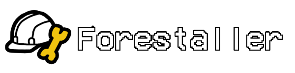
  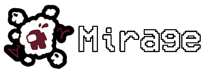
  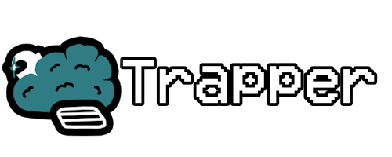
  
  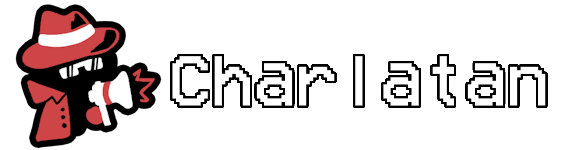
  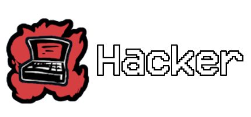
  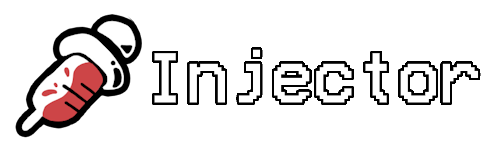
  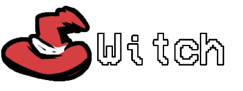
  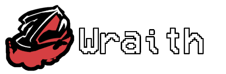
  
  
  
  
  
  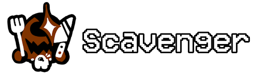
  
  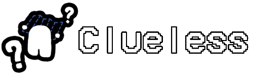
  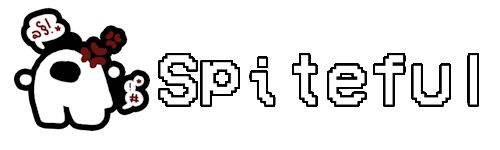

-----------------------

# Installation

1. Ensure you have [Town of Us: Mira](https://github.com/AU-Avengers/TOU-Mira) installed.
2. Build this project or download a release.
3. Place the compiled DLL in your `BepInEx/plugins/` folder.

-----------------------

# Building

1. Clone this repository.
2. Restore NuGet packages.
3. Build the solution in Visual Studio or using `dotnet build`.

-----------------------

# Requirements

- .NET 6.0
- Town of Us: Mira 1.5.0 or later
- MiraAPI 0.3.6 or later
- Reactor 2.5.0 or later

-----------------------

# Roles & Modifiers

## Crewmate Roles

### Forestaller (Support)
Complete all tasks to disable sabotages while alive. Revealed in meetings after completing all tasks.

### Mirage (Support)
Place a decoy with the appearance of a chosen target (yourself or a random player). If any player interacts with the decoy, it disappears instantly and both the Mirage and the toucher receive a notification. Cannot be guessed if the decoy has the appearance of yourself.

### Trapper (Support)
Place traps on vents that immobilize players who use them.

## Impostor Roles

### Witch (Power)
Cast spells on players to curse them. Spellbound players are highlighted in the next meeting and die after a configured amount of meetings. If the Witch dies, gets exiled, or is guessed, all spellbound players survive.

### Wraith (Power)
Dash ability increases movement speed by 75% for a short time. Lantern ability lets you place a hidden marker only you can see; reactivate it to teleport back and briefly turn invisible. If the Lantern expires before returning, it breaks and leaves permanent evidence visible to all players.

### Charlatan (Support)
Manipulate body reports to your advantage. Deceive allows you to report bodies you've killed from any distance for a limited time after killing. Conceal reduces the report range of nearby bodies, but requires you to stay near the body for the duration.

### Hacker (Support)
Download information from nearby equipment (Admin/Cams/Vitals/Door Log) to charge a portable device. Use the device anywhere to access the downloaded system. Jam disrupts information systems like comms being sabotaged, but emergency meetings can still be called. Gain jam charges from kills.

### Injector (Support)
Inject non-impostor players with a syringe that applies a random effect after a delay. Effects can be negative (inverted controls, low vision, slowness, confusion, inability to vent/use/report, nausea, weakness) or positive (speed boost, vision boost, regeneration). Effect duration can be set to a specific time, last the entire round, or persist for the whole game. Starts with a limited number of uses and gains additional uses from kills.

## Neutral Roles

### Lawyer (Benign)
Win by keeping your assigned client from being voted out. If your client gets voted out, you lose. Can object to votes during meetings to make players reconsider their votes.

### Serial Killer (Killing)
Kill everyone to win alone. Can optionally kill players who are in vents with them, but loses the ability to vent for the rest of the game after doing so.

### Scavenger (Evil)
Eat dead bodies to win alone. Must eat a configured number of bodies to win. Optionally, can use Scavenge to get arrows pointing to all corpses for a duration. If the win condition becomes impossible, the Scavenger becomes a configured role.

## Modifiers

### Clueless (Universal)
Removes all task guidance (task list, task arrows/markers, and map task locations). Tasks still function normally and contribute to the task bar.

### Spiteful (Universal)
When you are voted out, everyone who voted for you receives a negative effect. The effect can be lower vision, slowness, or increased cooldowns, and can last for a configured number of rounds or the rest of the game.

-----------------------

# Credits

## Art Credits

- **Asterisken** - Art for Injector, Trapper, Clueless, Mirage, Charlatan, Scavenger, and Spiteful
- **Atony** - Art for Serial Killer, Lawyer, Witch, and Wraith
- **Stellar Roles** - Role Ideas, some art (buttons)

-----------------------

# License
This software is distributed under the GNU GPLv3 License.

# Copyright

This mod is not affiliated with Among Us or Innersloth LLC, and the content contained therein is not endorsed or otherwise sponsored by Innersloth LLC. Portions of the materials contained herein are property of Innersloth LLC.

© Innersloth LLC.
