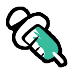
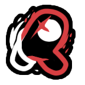
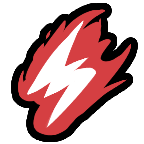

> [!NOTE]
> This repo is an extension mod for [Town of Us: Mira](https://github.com/AU-Avengers/TOU-Mira) that adds new roles and modifiers.\
> This mod requires Town of Us: Mira to be installed and is NOT for console versions of Among Us.\
> Forked from [TownOfUsMiraRolesExtension](https://github.com/rewalo/TownOfUsMiraRolesExtension) by rewalo.

> [!WARNING]
> This project is under constant development. Expect bugs, weird edge cases, and frequent changes! Please report any issues you find.
> 
> **AI Usage:** Artificial Intelligence was used during development to help with code and documentation.

-----------------------

  
  
                                         

 

An extension mod for [Town of Us: Mira](https://github.com/AU-Avengers/TOU-Mira) that adds new roles, modifiers, features, and an advanced Draft Mode!

> [!IMPORTANT]
> **Compatibility Note:** This extension mod is only guaranteed to work with the specific versions of **Town of Us: Mira** listed below. Due to differing releases on PC and Android, versions with an `x` (e.g., `17.3.x`) are compatible with all minor releases for both platforms.

| Among Us Version | TOU: Mira Version | Download Mira |
|------------------|-------------------|---------------|
| 17.3.x           | 1.6.2             | [Link](https://github.com/AU-Avengers/TOU-Mira/releases/tag/1.6.2) |
| 17.3.x           | 1.6.1             | [Link](https://github.com/AU-Avengers/TOU-Mira/releases/tag/1.6.1) |
| 17.3.x           | 1.6.0             | [Link](https://github.com/AU-Avengers/TOU-Mira/releases/tag/1.6.0) |

> [!TIP]
> **In-Game Patch Notes:** Every time a new version is released, you can view the full changelog directly in the game's Main Menu through our custom announcement system! (Inspired by **Town of Us: Mira** as it uses a similar system).

-----------------------

# Contents

- [**Contents**](#contents)
- [**Compatibility**](#compatibility-note)
- [**Installation**](#installation)
- [**Building**](#building)
- [**Requirements**](#requirements)
- [**Roles & Modifiers**](#roles--modifiers)
- [**Better Roles & Modifiers (Improvements)**](#better-roles--modifiers-improvements)
- [**Draft Mode**](#draft-mode)
- [**Security & Stability**](#security--stability)
- [**Localization 🇵🇱 🇺🇸**](#localization--)
- [**Chat Commands**](#chat-commands)
- [**Credits**](#credits)
- [**License**](#license)
- [**Copyright**](#copyright)

-----------------------

  
  
  
  
  
  
  
  
  
  
  
  
  
  
  
  
  
  
  
  
  
  
  
  
  
  
  
  
  
  
  
  
  
  
  
  
  
  
  
  
  
  
  
  
  
  
  

  
  
  
  
  
  
  
    
  
  

-----------------------

# Roles & Modifiers

## Crewmate Roles

### Falcon (Crewmate Investigative)
Zoom out the camera to see a wider area for a limited duration. Cannot be used during lights sabotage.

### Sage (Crewmate Investigative)
Compare Players Instead of Checking Alignments. Compare the alignments of other players, learning if players are friendly or enemies.

### Vanisher (Crewmate Investigative)
Vanisher can temporarily turn invisible to avoid being seen. May Neutral and Impostor roles get alert when u are close to them.

### Vampire Hunter (Crewmate Killing)
Vampire Hunter only appears when there are vampires in the game. Vampire Hunter stakes other players; if the player is not a vampire, the stake is wasted and nothing happens. If the targeted player is a vampire, they die. If there are no vampires left in the game, Vampire Hunter receives a new role based on the game settings.

### President (Crewmate Power)
Abstain from voting to bank votes, then spend them all at once in a future meeting.

### Bodyguard (Crewmate Protective)
Shield a player. When they're attacked, teleport to them and eliminate the attacker but you die too.

### Doctor (Crewmate Support)
Inject players with beneficial chemicals. After a short delay, they receive a random positive effect like a permanent shield, speed boost, or enhanced vision.

### Evoker (Crewmate Support)
Activate Blind to Flash all killing roles are blinded they cannot use any abilities and can only see themselves. Depending on the host settings, the Evoker may verify whether players are killing roles or not.

### Forestaller (Crewmate Support)
Complete all tasks to disable sabotages while alive. Revealed in meetings after completing all tasks.

### Mirage (Crewmate Support)
Place a decoy with the appearance of yourself or a random player. If anyone interacts with it, it vanishes and both sides are notified.

### Trapper (Crewmate Support)
Place traps on vents that immobilize players who use them. Get notifications when traps are triggered.

## Impostor Roles

### Astral (Impostor Concealing)
Phase through walls to bypass obstacles. Teleport back to your starting position after a delay. You must eliminate a target while phased to survive!

### Speedy (Impostor Concealing)
Gain a permanent speed boost each time you eliminate a player. Can be configured to stack or have a maximum limit.

### Detonator (Impostor Killing)
Attach a C4 bomb to a player. Detonate it manually to eliminate the target and anyone nearby.

### Kamikaze (Impostor Killing)
Detonate yourself to kill all nearby players. You die in the process.

### Outlaw (Impostor Killing)
After killing, you have a short window to kill additional players without cooldown.

### Witch (Impostor Killing)
Cast spells on players. Spellbound players are highlighted in meetings and die after a configured number of meetings. If the Witch dies, all spellbound players survive.

### Poisoner (Impostor Power)
Poison players on contact (delayed death) or use Vine to remotely kill the nearest player in range.

### RC-XD (Impostor Power)
Deploy a remote-controlled explosive car. Drive it with arrow keys and detonate it near enemies.

### Wraith (Impostor Power)
Dash for a speed boost. Place a Lantern to teleport back to it and briefly turn invisible. If the Lantern expires, it leaves permanent evidence.

### Charlatan (Impostor Support)
Deceive to report your own kills from any distance. Conceal to reduce the report range of nearby bodies.

### Hacker (Impostor Support)
Download info from Admin/Cams/Vitals to charge a portable device. Jam disrupts info systems like comms sabotage. Gain jam charges from kills.

### Injector (Impostor Support)
Inject players with a random effect (negative or positive) after a delay. Starts with limited uses, gains more from kills.

## Neutral Roles

### Lawyer (Neutral Benign)
Win by keeping your assigned client from being voted out. Object to votes during meetings.

### Shifter (Neutral Benign)
Steal another player's role at the next meeting. You can only steal a Crewmate role if you attempt to steal a non-Crewmate role, you die in the process.

### Bounty Hunter (Neutral Evil)
Hunt assigned targets. The Bounty Hunter can only kill their assigned targets. Eliminate all targets to win.

### Pirate (Neutral Evil)
Challenge players to Rock-Paper-Scissors duels during meetings. Win enough duels to win the game.

### Pope (Neutal Evil)
Canonize all living players, then trigger Divine Judgement a countdown that kills everyone if it reaches zero.

### Vulture (Neutral Evil)
Eat dead bodies to win. Optionally use Scavenge for arrows to corpses. If win condition becomes impossible, become a configured role.

### Doppelganger (Neutral Killing)
Kill players to steal their appearance until the next meeting.

### Pelican (Neutral Killing)
Swallow players to trap them in your stomach. They're digested when a meeting is called. If you die, they escape.

### Serial Killer (Neutral Killing)
Kill everyone to win alone. Can optionally kill players in vents, but loses venting ability after.

### Shroud (Neutral Killing)
Mark a player with a deadly trap. Anyone who interacts with them dies. If no one does, the marked player dies at the meeting.

## Modifiers

### Child (Universal Passive)
While underage, you cannot be killed. You age over time. Once adult, you lose protection.

### Clueless (Universal Passive)
Removes all task guidance (task list, arrows, map locations). Tasks still work normally.

### Death Note (Neutral Utility)
Find a notebook near a vent. Write a player's name to curse them with a delayed heart attack death.

### Drunk (Universal Passive)
Movement controls are inverted for a set number of meetings.

### Spiteful (Universal Passive)
When voted out, everyone who voted for you receives a negative effect (lower vision, slowness, or increased cooldowns).

### Lucky (Impostor Passive)
After each kill, your kill cooldown is randomized between a configured min and max.

### Venomous (Neutral Killing)
After a set amount of time, the body of a killed player will rot away, preventing it from being reported.

### Publicity (Crewmate Passive)
See the real colors of player's votes during meetings.

## Additional Features & Tweaks

### Polish Language Support
An option added to use Polish localizations via `ExtensionLocalSettingUsePolish`.

### Classic Assassin Guessing
Optional cycling-style assassin guessing (arrows + guess button instead of panel menu). The advantage of this setting is that once you select a role to guess and the meeting ends, that person's role is saved on the next meeting.

### Legacy Guess Death Animation
Optional old-style death animation for guessing.

-----------------------

# Better Roles & Modifiers (Improvements)

This extension focuses on improving existing roles from Town of Us: Mira. These can be configured in the **Better Roles/Modifiers** tab in the lobby.

### Better Role: Time Lord (FULLY FIXED)
- **Physical Position Rewind:** Now correctly rewinds actual player coordinates.
- **Revive Thresholds:** Fixed game-breaking logic where revives were inconsistent.
- **Speed Multiplier:** Configure the rewind animation speed (0.5x - 5.0x).
- **Pelican Fix:** Swallowed players are safely ejected during rewind.

### Better Role: Vampire
- **Vampire Sabotage:** Finalized sabotage system (TAB-only).
- **Lights Sabotage Restriction:** Toggle whether Vampires can only sabotage Lights.

### Better Role: Mirror Caster
- **Move While Targeting:** Option to move freely (WASD) while the targeting map is open.
- **Instant Selection:** Fixed targeting buttons to respond on the first click.

### Better Role: Forensic
- **Freeze Scenes:** Option to stop tracking suspects once a meeting starts.
- **Suspect Logic:** Improved suspect identification to prevent false positives.

### Better Role: Mayor
- **Custom Votes:** Supports **3-10 votes** based on lobby settings.

### Better Role: Sonar
- **Map Overlays:** Custom player head map pointers and arrow overlays.

### Better Modifier: Egotist
- **Vent Access:** Toggle whether the Egotist can use vents.
- **Impostor Vision:** Optional enhanced vision.
- **Vent Cooldown:** Fully customizable vent timings.

-----------------------

# Draft Mode

Draft Mode is a special game feature that lets players take turns choosing their roles before the game starts, similar to draft picks in sports or competitive games.

## How It Works

1. **Pre-Game Setup** - Host enables Draft Mode in the lobby options
2. **Draft Phase** - When the game starts, instead of random role assignment, a draft UI appears
3. **Unified Picking** - Players select their role from a comprehensive pool of available roles for their assigned side (Crewmate, Impostor, or Neutral).
4. **Timer** - Each player has limited time to pick (configurable by host)
5. **Random Fallback** - If a player doesn't pick in time, a random role is assigned
6. **Game Start** - Once all players have picked, the game begins with chosen roles.

> [!IMPORTANT]
> By default, Draft Mode **does NOT use** the original Town of Us: Mira role chances or spawn settings. The draft pool is generated based on Draft-specific configuration. However, you can enable the **"Respect Role Chances"** option in the lobby to use your standard spawn probabilities.

## Features

- **Visual Draft UI** - Clean interface showing available roles, current picker, and time remaining
- **Unified Role Pool** - No more restrictive categories! Players choose from all enabled roles for their side.
- **Unified Neutral Distribution** - Intelligent mixing of Neutral roles into the Crewmate pool based on global targets and per-choice limits.
- **60/40 Probability Logic** - Balanced distribution that favors minimum targets but occasionally spikes to maximums for variety.
- **Balanced Pick Order (System of Thirds)** - Ensures Impostors and Neutrals are evenly spread across the start, middle, and end of the draft.
- **Streak Reduction** - Robust protection against players getting the same killing faction (Impostor or NK) multiple games in a row.
- **Pick Order Display** - See how many turns until your pick
- **Audio Cues** - Alert on draft complete, your turn, and pick confirmation
- **Random Button** - Can't decide? Pick a random role from your side
- **Instant Start** - Automatically skips the Among Us countdown after the picking phase is complete to jump straight into the round.

## Configuration Options

| Option | Description |
|--------|-------------|
| Enable Draft Mode | Toggle draft mode on/off |
| Lock Lobby During Draft | Prevent players from joining mid-draft |
| Roles To Show | Number of role options displayed for each player |
| Time To Choose | Seconds each player has to pick (3s - 67s) |
| Min/Max Neutrals Per Choice | Number of Neutral roles mixed into Crewmate choices (60/40 weighted) |
| Reduce Killing Streak | Lower the chance of players being killing roles multiple times in a row |
| Impostor / Neutral Killing | Configure streak reduction probability (0-100%) for specific factions |
| Min/Max Other Neutrals | Global target range for Neutral Benign/Evil/Outlier roles in the game |
| Min/Max Neutral Killing | Global target range for Neutral Killing roles in the game |
| Use Role Chances | Draft pool follows lobby spawn probabilities (Weighted Shuffle) |

## Showcase

### Visual Gallery

  <table border="0">
    <tr>
      <td></td>
      <td></td>
      <td></td>
    </tr>
  </table>

### Gameplay Video
> [!TIP]
> Watch the Draft Mode in action below!

https://github.com/user-attachments/assets/d7a01fdc-148b-4a66-bbf1-6043da6a9b04

-----------------------

# Installation

1. Ensure you have [Town of Us: Mira](https://github.com/AU-Avengers/TOU-Mira) installed.
2. Build this project or download a release.
3. Place the compiled DLL in your `BepInEx/plugins/` folder.

-----------------------

# Building

1. Clone this repository.
2. Restore NuGet packages.
3. Build the solution in Visual Studio or using `dotnet build`.

-----------------------

# Requirements

- .NET 6.0
- Town of Us: Mira 1.6.2 or later
- MiraAPI 0.4.0 or later
- Reactor 2.5.0 or later

-----------------------

# Credits

## Original Extension
- **[rewalo](https://github.com/rewalo)** - Original [TownOfUsMiraRolesExtension](https://github.com/rewalo/TownOfUsMiraRolesExtension) that this project is forked from

## Art Credits

> **Huge shoutout to Atony**, creator of Town of Us: Mira — roughly 70% of the art assets used in this mod originate from his work, various TOU Mira builds, and resources shared on the TOU Mira Discord. We are extremely grateful for his incredible contributions to the community.

- **Asterisken** - Art for Injector, Trapper, Clueless, Mirage, Charlatan, Vulture, Forestaller, Spiteful and Objection Button
- **Atony / Town of Us: Mira / Town Of Us Discord** - Art for Serial Killer, Lawyer, Witch, Wraith, Kamikaze, Detonator, Astral, Speedy, Doctor, RC-XD; Shifter role icon & button; Bodyguard role icon; Vampire Hunter role icon; Vanisher icon; Sage role icon (Seer button from TOU Mira); Sage ability buttons (Salem option buttons from Seer); Bodyguard shield animation (repainted Warden shield from TOU Mira 1.5.9); Poisoner role icon & all Poisoner button icons; Evoker Verify button icon; Shroud ability button icon; Drunk modifier icon (from TOU Mira Discord); Venomous modifier icon (flipped & recolored Rotting modifier from TOU Mira)
- **Atony / TOU Mira Fusion** - Vampire Hunter stake button
- **Stellar Roles** - Role ideas, some button art
- **[Launchpad Reloaded](https://github.com/All-Of-Us-Mods/LaunchpadReloaded)** - Doppelganger role icon
- **[All Of Us](https://github.com/All-Of-Us-Mods)** - Death Note modifier icons (from their Discord)
- **Sidemen (YouTube)** - RC-XD Deploy & Detonate button icons
- **[TOHE (Town of Host Enhanced)](https://github.com/0xDrMoe/TownofHost-Enhanced)** - Shroud role icon
- **Star Wars** - Bounty Hunter role icon
- **Our friend's girlfriend** - Publicity modifier icon

## Sound Credits
- **Radzik360** - Joker laugh (intro & in-game), Kamikaze explosion sound, Pelican swallow sound
- **Ano** - Pope intro sound
- **Innersloth & Puffballs United** - Draft music ("Seek")
- **Tajemniczy Among Us (Tajemniczy Typiarz)** - Draft pick sound, Draft alert sound
- **Death Note (anime)** - Death Note kill sound (Light's laugh)
- **YouTube** - Pope alarm & Judgement end sounds (from Divine Judgement concept videos)
- **Star Wars** - Bounty Hunter intro sound
- **Max Verstappen memes** - RC-XD intro sound (song fragment)
- RC-XD driving sound from a royalty-free sound website

## Role Inspirations & Concepts
- **[TOHE (Town of Host Enhanced)](https://github.com/0xDrMoe/TownofHost-Enhanced)** - Doppelganger role concept; Shroud role concept
- **[Syzyfowe TOU ](https://github.com/LimeShep/Town-Of-Us/)** - Evoker role concept; Pelican role concept
- **Tajemniczy Among Us (Tajemniczy Typiarz)** - Pirate role concept
- **[Town of Us WYGON ](https://github.com/wygon/Town-Of-Us-WYGON)** - Falcon role concept; Kamikaze role concept
- **Sidemen (YouTube)** - RC-XD, Detonator, Doctor, Astral, Speedy & Poisoner roles concept (recreated from their videos)
- **Death Note (anime)** - Death Note modifier concept
- **Our friend Weakpass** - Added Publicity modifier

## Wiki & Documentation
- **dziabe** - Helped with shortening role descriptions for the wiki (minimal effort)

-----------------------

# Security & Stability

### Duplicate Extension Guard
To ensure maximum stability and prevent frequent crashes, the mod includes a built-in **Duplicate Checker**. If you accidentally leave an old version of the mod (like `TouMegaChujoweExtension (1).dll`) in your plugins folder, the game will:
1. Display a massive red warning on the Main Menu.
2. Automatically prevent you from joining or hosting lobbies until the duplicate is removed.
This protects both you and other players from unexpected "Assembly not registered" errors.

### Memory & Performance
The extension is optimized to prevent common IL2CPP memory leaks. We've eliminated "Death Loops" in UI button logic that previously caused FPS drops and `OutOfMemoryException`.

-----------------------

# Localization 🇵🇱 🇺🇸

This mod features **100% complete Polish translation**, including:
- Role descriptions and abilities.
- Lobby options and tooltips.
- In-game notifications and win screens.
- Custom "Better Roles" settings tab.

You can toggle between **English** and **Polish** in the game settings via `ExtensionLocalSettingUsePolish`.

-----------------------

## Frameworks & Dependencies
- **[Town of Us: Mira](https://github.com/AU-Avengers/TOU-Mira)** - Base mod
- **[MiraAPI](https://github.com/All-Of-Us-Mods/MiraAPI)** - Modding framework
- **[Reactor](https://github.com/NuclearPowered/Reactor)** - Mod dependency
- **[BepInEx](https://github.com/BepInEx)** - Game function hooking

## Honorable Mention 🙃
- **Pozwo** for encouraging us to bring this project to Github!
- **Arbuzia** for saying that im too young to program mods without putting in them viruses!
- no offence lol
- **Majusia** died during development of mod, born in 15.01.26 died in 23.01.2026 Rest in Pieces (absolutely serious)

-----------------------

# License & Copyright
This software is distributed under the GNU GPLv3.0 License.

# Copyright

This mod is not affiliated with Among Us or Innersloth LLC, and the content contained therein is not endorsed or otherwise sponsored by Innersloth LLC. Portions of the materials contained herein are property of Innersloth LLC.

© Innersloth LLC.

