> [!NOTE]
> This repo is an extension mod for [Town of Us: Mira](https://github.com/AU-Avengers/TOU-Mira) that adds new roles and modifiers.\
> This mod requires Town of Us: Mira to be installed and is NOT for console versions of Among Us.\
> Forked from [TownOfUsMiraRolesExtension](https://github.com/rewalo/TownOfUsMiraRolesExtension) by rewalo.

> [!WARNING]
> This project is under constant development. Expect bugs, weird edge cases, and frequent changes! Please report any issues you find.
> 
> **AI Usage:** Artificial Intelligence was used during development to help with code and documentation.

>  [!TIP]
> Want to suggest ideas, help with graphics, report issues, or find people to play with? Join our [Discord](https://discord.gg/qaQZAmAVh4) — we have a diverse and friendly community!

> [!IMPORTANT]
> **Voice Chat:** For proximity voice chat with this extension, install the regular **[Perfect Comms](https://github.com/artriy/Perfect-Comms/releases/latest)** v3.0.0 or newer. Tou Mega Chujowe Extension integrates with Perfect Comms through its public API, which now supports all options and features from the extension, so the old custom Perfect Comms fork is no longer required and is not planned to be continued.

-----------------------

  
  
                                         

 

An extension mod for [Town of Us: Mira](https://github.com/AU-Avengers/TOU-Mira) that adds new roles, modifiers, features, and an advanced Draft Mode!

> [!IMPORTANT]
> **Compatibility Note:** This extension mod is only guaranteed to work with the specific versions of **Town of Us: Mira** listed below. Due to differing releases on PC and Android, versions with an `x` (e.g., `17.3.x`) are compatible with all minor releases for both platforms.

| Extension Version | Among Us Version | TOU: Mira Version | Download Mira |
|-------------------|------------------|-------------------|---------------|
| 1.4.3 or newer    | 17.3.x           | 1.6.3             | [Link](https://github.com/AU-Avengers/TOU-Mira/releases/tag/1.6.3) |
| 1.3.0 or newer    | 17.3.x           | 1.6.2             | [Link](https://github.com/AU-Avengers/TOU-Mira/releases/tag/1.6.2) |
| Older than 1.3.0  | 17.3.x           | 1.6.1             | [Link](https://github.com/AU-Avengers/TOU-Mira/releases/tag/1.6.1) |
| Older than 1.3.0  | 17.3.x           | 1.6.0             | [Link](https://github.com/AU-Avengers/TOU-Mira/releases/tag/1.6.0) |

> [!TIP]
> **In-Game Patch Notes:** Every time a new version is released, you can view the full changelog directly in the game's Main Menu through our custom announcement system! (Inspired by **Town of Us: Mira** as it uses a similar system).

-----------------------

# Contents

- [**Contents**](#contents)
- [**Compatibility**](#compatibility-note)
- [**Installation**](#installation)
- [**Building**](#building)
- [**Requirements**](#requirements)
- [**Roles & Modifiers (Wiki)**](https://github.com/HekerB/TownOfUsMegaChujoweExtension/wiki)
- [**Better Roles & Modifiers (Improvements)**](#better-roles--modifiers-improvements)
- [**Draft Mode**](#draft-mode)
- [**Security & Stability**](#security--stability)
- [**Localization 🇵🇱 🇺🇸**](#localization--)
- [**Credits**](#credits)
- [**License**](#license)
- [**Copyright**](#copyright)

-----------------------

# Roles & Modifiers

> [!IMPORTANT]
>  **Full documentation for all roles, modifiers, and game options is available on the Wiki:**
>
> ### **[Open the Wiki](https://github.com/HekerB/TownOfUsMegaChujoweExtension/wiki)**
>
> The Wiki contains detailed descriptions, categorized by faction (Crewmate, Impostor, Neutral) and subcategory (Investigative, Killing, Support, etc.), along with all configurable game options and their default values.

  
  
  
  <a href="https://github.com/HekerB/TownOfUsMegaChujoweExtension/wiki#spirit-master">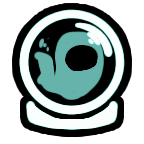</a>
  
  <a href="https://github.com/HekerB/TownOfUsMegaChujoweExtension/wiki#agent">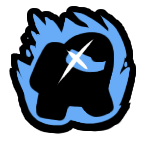</a>
  
  
  
  
  
  
  <a href="https://github.com/HekerB/TownOfUsMegaChujoweExtension/wiki#gardener">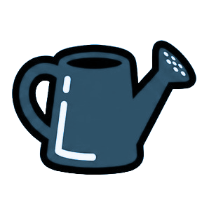</a>
  <a href="https://github.com/HekerB/TownOfUsMegaChujoweExtension/wiki#tavern-keeper">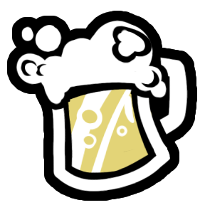</a>
  
  
  
  
  
  <a href="https://github.com/HekerB/TownOfUsMegaChujoweExtension/wiki#portalmaker">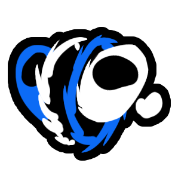</a>
  
  
  
  <a href="https://github.com/HekerB/TownOfUsMegaChujoweExtension/wiki#burrower">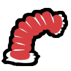</a>
  
  
  
  
  
  
  <a href="https://github.com/HekerB/TownOfUsMegaChujoweExtension/wiki#sniper">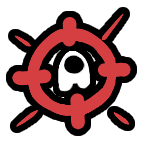</a>
  
  <a href="https://github.com/HekerB/TownOfUsMegaChujoweExtension/wiki#gun-game">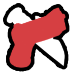</a>
  
  
  
  
  
  
  
  
  <a href="https://github.com/HekerB/TownOfUsMegaChujoweExtension/wiki#flipper">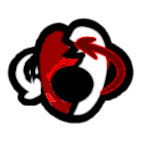</a>
  <a href="https://github.com/HekerB/TownOfUsMegaChujoweExtension/wiki#voodoo-master">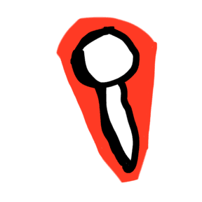</a>
  
  
  
  
  
  
  
  
  
  <a href="https://github.com/HekerB/TownOfUsMegaChujoweExtension/wiki#innocent">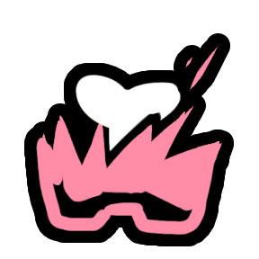</a>
  
  <a href="https://github.com/HekerB/TownOfUsMegaChujoweExtension/wiki#baker--famine">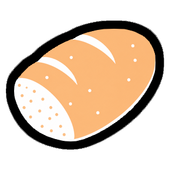</a>
  <a href="https://github.com/HekerB/TownOfUsMegaChujoweExtension/wiki#baker--famine">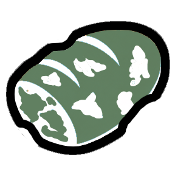</a>
  <a href="https://github.com/HekerB/TownOfUsMegaChujoweExtension/wiki#soul-collector--death">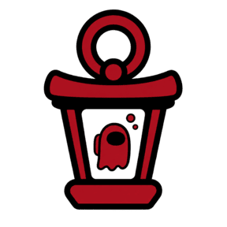</a>
  <a href="https://github.com/HekerB/TownOfUsMegaChujoweExtension/wiki#berserker--war">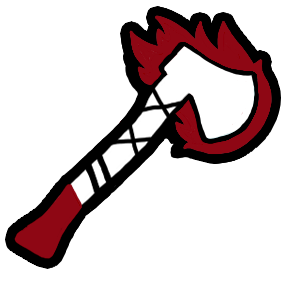</a>
  <a href="https://github.com/HekerB/TownOfUsMegaChujoweExtension/wiki#berserker--war">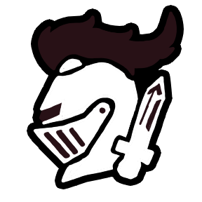</a>
  
  
  
  
  
  <a href="https://github.com/HekerB/TownOfUsMegaChujoweExtension/wiki#arcanist">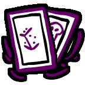</a>
  <a href="https://github.com/HekerB/TownOfUsMegaChujoweExtension/wiki#infiltrator">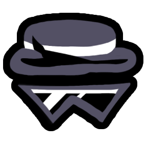</a>
  
  
  
  
  
  
  
  
  
  
  
  

-----------------------

# Better Roles & Modifiers (Improvements)

This extension focuses on improving existing roles from Town of Us: Mira. These can be configured in the **Better Roles/Modifiers** tab in the lobby.

### Better Role: Time Lord (FULLY FIXED)
- **Physical Position Rewind:** Now correctly rewinds actual player coordinates.
- **Revive Thresholds:** Fixed game-breaking logic where revives were inconsistent.
- **Speed Multiplier:** Configure the rewind animation speed (0.5x - 5.0x).
- **Pelican Fix:** Swallowed players are safely ejected during rewind.

### Better Role: Vampire
- **Vampire Sabotage:** Finalized sabotage system (TAB-only).
- **Lights Sabotage Restriction:** Toggle whether Vampires can only sabotage Lights.

### Better Role: Mirror Caster
- **Move While Targeting:** Option to move freely (WASD) while the targeting map is open.
- **Instant Selection:** Fixed targeting buttons to respond on the first click.

### Better Role: Forensic
- **Freeze Scenes:** Option to stop tracking suspects once a meeting starts.
- **Suspect Logic:** Improved suspect identification to prevent false positives.

### Better Role: Mayor
- **Custom Votes:** Supports **3-10 votes** based on lobby settings.

### Better Role: Sonar
- **Map Overlays:** Custom player head map pointers and arrow overlays.

### Better Modifier: Egotist
- **Vent Access:** Toggle whether the Egotist can use vents.
- **Impostor Vision:** Optional enhanced vision.
- **Vent Cooldown:** Fully customizable vent timings.

-----------------------

# Draft Mode

Draft Mode is a special game feature that lets players take turns choosing their roles before the game starts, similar to draft picks in sports or competitive games.

## How It Works

1. **Pre-Game Setup** - Host enables Draft Mode in the lobby options
2. **Draft Phase** - When the game starts, instead of random role assignment, a draft UI appears
3. **Unified Picking** - Players select their role from a comprehensive pool of available roles for their assigned side (Crewmate, Impostor, or Neutral).
4. **Timer** - Each player has limited time to pick (configurable by host)
5. **Random Fallback** - If a player doesn't pick in time, a random role is assigned
6. **Game Start** - Once all players have picked, the game begins with chosen roles.

> [!IMPORTANT]
> By default, Draft Mode **does NOT use** the original Town of Us: Mira role chances or spawn settings. The draft pool is generated based on Draft-specific configuration. However, you can enable the **"Respect Role Chances"** option in the lobby to use your standard spawn probabilities.

## Features

- **Visual Draft UI** - Clean interface showing available roles, current picker, and time remaining
- **Unified Role Pool** - No more restrictive categories! Players choose from all enabled roles for their side.
- **Unified Neutral Distribution** - Intelligent mixing of Neutral roles into the Crewmate pool based on global targets and per-choice limits.
- **60/40 Probability Logic** - Balanced distribution that favors minimum targets but occasionally spikes to maximums for variety.
- **Balanced Pick Order (System of Thirds)** - Ensures Impostors and Neutrals are evenly spread across the start, middle, and end of the draft.
- **Streak Reduction** - Robust protection against players getting the same killing faction (Impostor or NK) multiple games in a row.
- **Pick Order Display** - See how many turns until your pick
- **Audio Cues** - Alert on draft complete, your turn, and pick confirmation
- **Random Button** - Can't decide? Pick a random role from your side
- **Instant Start** - Automatically skips the Among Us countdown after the picking phase is complete to jump straight into the round.

## Configuration Options

| Option | Description |
|--------|-------------|
| Enable Draft Mode | Toggle draft mode on/off |
| Lock Lobby During Draft | Prevent players from joining mid-draft |
| Roles To Show | Number of role options displayed for each player |
| Time To Choose | Seconds each player has to pick (3s - 67s) |
| Min/Max Neutrals Per Choice | Number of Neutral roles mixed into Crewmate choices (60/40 weighted) |
| Reduce Killing Streak | Lower the chance of players being killing roles multiple times in a row |
| Impostor / Neutral Killing | Configure streak reduction probability (0-100%) for specific factions |
| Min/Max Other Neutrals | Global target range for Neutral Benign/Evil/Outlier roles in the game |
| Min/Max Neutral Killing | Global target range for Neutral Killing roles in the game |
| Use Role Chances | Draft pool follows lobby spawn probabilities (Weighted Shuffle) |

## Showcase

### Visual Gallery

  <table border="0">
    <tr>
      <td></td>
      <td></td>
      <td></td>
    </tr>
  </table>

### Gameplay Video
> [!TIP]
> Watch the Draft Mode in action below!

https://github.com/user-attachments/assets/d7a01fdc-148b-4a66-bbf1-6043da6a9b04

-----------------------

# Installation

1. Ensure you have [Town of Us: Mira](https://github.com/AU-Avengers/TOU-Mira) installed.
2. Build this project or download a release.
3. Place the compiled DLL in your `BepInEx/plugins/` folder.

## Optional Voice Chat

Use **[Perfect Comms](https://github.com/artriy/Perfect-Comms)** if you want in-game proximity voice chat. TouMCE integrates with Perfect Comms through its public API, which now supports all options and features from the extension, so the custom fork is no longer required.

-----------------------

# Building

1. Clone this repository.
2. Restore NuGet packages.
3. Build the solution in Visual Studio or using `dotnet build`.

-----------------------

# Requirements

- .NET 6.0
- Town of Us: Mira 1.6.2 or later
- MiraAPI 0.4.0 or later
- Reactor 2.5.0 or later

-----------------------

# Credits

## Original Extension
- **[rewalo](https://github.com/rewalo)** - Original [TownOfUsMiraRolesExtension](https://github.com/rewalo/TownOfUsMiraRolesExtension) that this project is forked from

## Artwork & Asset Credits

> **Huge shoutout to Atony**, creator of Town of Us: Mira. A large part of this mod's art comes from his work, Town of Us: Mira builds, and resources shared around the TOU Mira community.

- **[Asterisken [スター]](https://github.com/aasteriisken)** ([Discord](https://discord.com/users/1220041311323684955)) - Injector, Trapper, Clueless, Mirage, Charlatan, Vulture, Forestaller, Spiteful, Objection Button, Bodyguard Guard button, Soul Collector role icon, Berserker role icon, and War role icon
- **Atony / Town of Us: Mira / Town of Us Discord** - Serial Killer, Kamikaze, Loner, Joker, Burrower, Lawyer, Witch, Wraith, Doctor, RC-XD, Portalmaker, Vanisher, Vampire Hunter, Bodyguard, Bounty Hunter, Pelican, Doppelganger, Speedy, Astral, Sniper, Detonator; Shifter role icon and button; Poisoner role icon and buttons; Drunk modifier icon; Jackal and Sidekicks icons; Innocent role icon; Flipper (changed) role icon; Tavern Keeper role icon; Agent role icon.
- **Atony / [Town Of Us Fusion](https://github.com/AtonyGit/Town-Of-Us-Fusion)** - Vampire Hunter stake button
- **CraftR / Town of Us Discord** - Pirate role icon and Pirate Duel button; Baker role icon and bread assets; Pope role icon and Sanctify button
- **CraftR / [Town-Of-Us-Mira-JK](https://github.com/JoaKing08/Town-Of-Us-Mira-JK)** - Famine role icon
- **[TownOfUsMiraDivaniModsAddOn](https://github.com/DivaniNL/TownOfUsMiraDivaniModsAddOn) / DivaniNL** - Portal asset and Kamikaze role icon source
- **Syzyf / Syzyfowe TOU** - Gardener ability button icon
- **Xinav's** - Tarot card asset
- **Town of Salem** - Shroud visual assets/source inspiration
- **Unknown** - The Voodoo Master icon was taken from original rewalo's extension.

## Sound Credits
- **Radzik360** - Joker laugh (intro & in-game), Kamikaze explosion sound, Pelican swallow sound
- **Ano** - Pope intro sound
- **Innersloth & Puffballs United** - Draft music ("Seek")
- **Tajemniczy Among Us (Tajemniczy Typiarz)** - Draft pick sound, Draft alert sound
- **Death Note (anime)** - Death Note kill sound (Light's laugh)
- **YouTube** - Pope alarm & Sanctify end sounds
- **Star Wars** - Bounty Hunter intro sound
- **Max Verstappen memes** - RC-XD intro sound (song fragment)
- **Free sound library** - RC-XD driving sound
- **Minecraft** - Creeper explosion sound used for RC-XD explosion
- **Fortnite** - Sniper shot sound
- **Counter Strike** - Detonator beeping sound

## Role Inspirations & Concepts
- **[TOHE (Town of Host Enhanced)](https://github.com/0xDrMoe/TownofHost-Enhanced)** - Doppelganger role concept; Shroud role concept
- **[Syzyfowe TOU](https://github.com/LimeShep/Town-Of-Us/)** - Evoker, Pelican, and Gardener role concepts
- **Town of Us: Mira** - Infiltrator (Jackal) role concept
- **Town of Salem 1 & 2** - Pirate role, Berserker, War, Baker, Famine, Soul Collectorm, Death and Shroud role concepts
- **[Town of Us WYGON](https://github.com/wygon/Town-Of-Us-WYGON)** - Falcon and Kamikaze role concepts
- **Sidemen (YouTube)** - RC-XD, Detonator, Doctor, Astral, Speedy, Sniper, Poisoner, and Loner role concepts
- **[TownOfUsMiraDivaniModsAddOn](https://github.com/DivaniNL/TownOfUsMiraDivaniModsAddOn)** - Portalmaker role concept
- **[Town-Of-Us-Mira-JK](https://github.com/JoaKing08/Town-Of-Us-Mira-JK)** - Berserker and War Apocalypse role concept
- **Stellar Roles** - Role ideas and ability references
- **[All Of Us](https://github.com/All-Of-Us-Mods)** - Death Note concept and recreated assets

## Wiki & Documentation
- **dziabe** - Helped with shortening role descriptions for the wiki (minimal effort)

-----------------------

# Security & Stability

### Duplicate Extension Guard
To ensure maximum stability and prevent frequent crashes, the mod includes a built-in **Duplicate Checker**. If you accidentally leave an old version of the mod (like `TouMegaChujoweExtension (1).dll`) in your plugins folder, the game will:
1. Display a massive red warning on the Main Menu.
2. Automatically prevent you from joining or hosting lobbies until the duplicate is removed.
This protects both you and other players from unexpected "Assembly not registered" errors.

### Memory & Performance
The extension is optimized to prevent common IL2CPP memory leaks. We've eliminated "Death Loops" in UI button logic that previously caused FPS drops and `OutOfMemoryException`.

-----------------------

# Localization 🇵🇱 🇺🇸

This mod features **100% complete Polish translation**, including:
- Role descriptions and abilities.
- Lobby options and tooltips.
- In-game notifications and win screens.
- Custom "Better Roles" settings tab.

You can toggle between **English** and **Polish** in the game settings via `ExtensionLocalSettingUsePolish`.

-----------------------

## Frameworks & Dependencies
- **[Town of Us: Mira](https://github.com/AU-Avengers/TOU-Mira)** - Base mod
- **[MiraAPI](https://github.com/All-Of-Us-Mods/MiraAPI)** - Modding framework
- **[Reactor](https://github.com/NuclearPowered/Reactor)** - Mod dependency
- **[BepInEx](https://github.com/BepInEx)** - Game function hooking

## Honorable Mention 
- **Pozwo** for encouraging us to bring this project to Github!
- **Arbuzia** for saying that im too young to program mods without putting in them viruses!
- no offence lol
- **Majusia** died during development of mod, born in 15.01.26 died in 23.01.2026 Rest in Pieces (absolutely serious)

-----------------------

# License & Copyright
This software is distributed under the GNU GPLv3.0 License.

# Copyright

This mod is not affiliated with Among Us or Innersloth LLC, and the content contained therein is not endorsed or otherwise sponsored by Innersloth LLC. Portions of the materials contained herein are property of Innersloth LLC.

© Innersloth LLC.

