> [!NOTE]
> This repo is an extension mod for [Town of Us: Mira](https://github.com/AU-Avengers/TOU-Mira) that adds new roles and modifiers.\
> This mod requires Town of Us: Mira to be installed and is NOT for console versions of Among Us.\
> Forked from [TownOfUsMiraRolesExtension](https://github.com/rewalo/TownOfUsMiraRolesExtension) by rewalo.

> [!WARNING]
> This project is under constant development and much of the code was written **(a bit)** with the assistance of AI. Expect bugs, weird edge cases, and frequent changes! Please report any issues you find.

-----------------------

  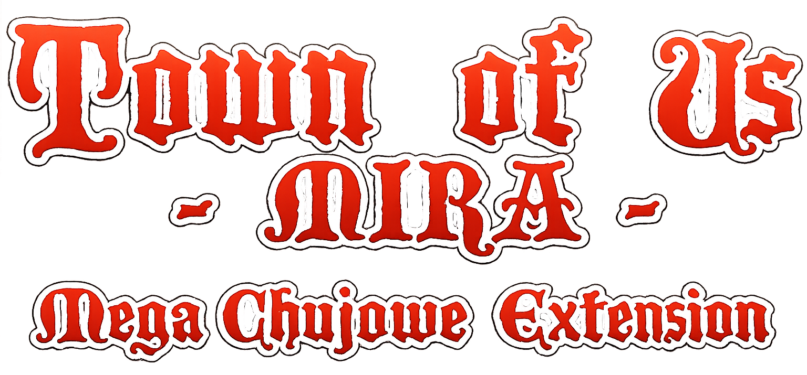
  
                                         

 

An extension mod for [Town of Us: Mira](https://github.com/AU-Avengers/TOU-Mira) that adds new roles, modifiers, features, and the best, Draft Mode!

-----------------------

# Contents

- [**Contents**](#contents)
- [**Installation**](#installation)
- [**Building**](#building)
- [**Requirements**](#requirements)
- [**Roles & Modifiers**](#roles--modifiers)
- [**Chat Commands**](#chat-commands)
- [**Credits**](#credits)
- [**License**](#license)
- [**Copyright**](#copyright)

-----------------------

  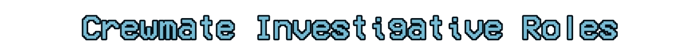
  
  <a href="#sage-investigative">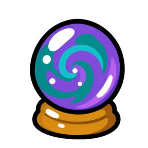</a>
  <a href="#vanisher-investigative">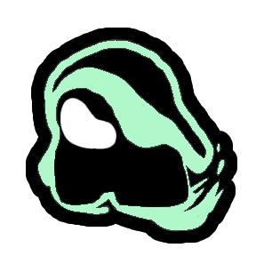</a>
  
  <a href="#vampire-hunter-killing">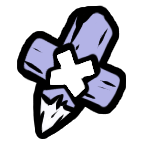</a>
  
  <a href="#president-power">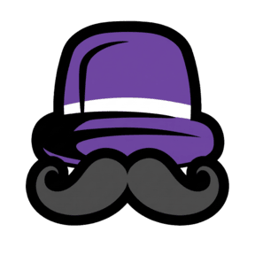</a>
  
  <a href="#bodyguard-protective">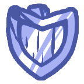</a>
  
  
  <a href="#forestaller-support">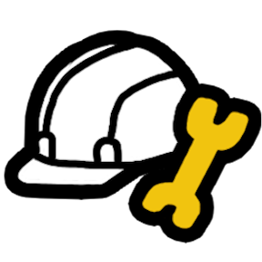</a>
  <a href="#mirage-support">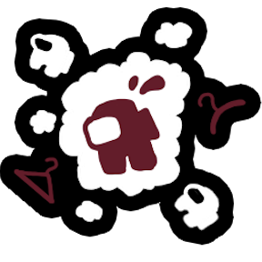</a>
  <a href="#trapper-support">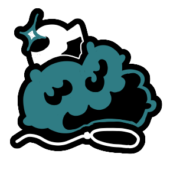</a>
  
  <a href="#kamikaze-killing">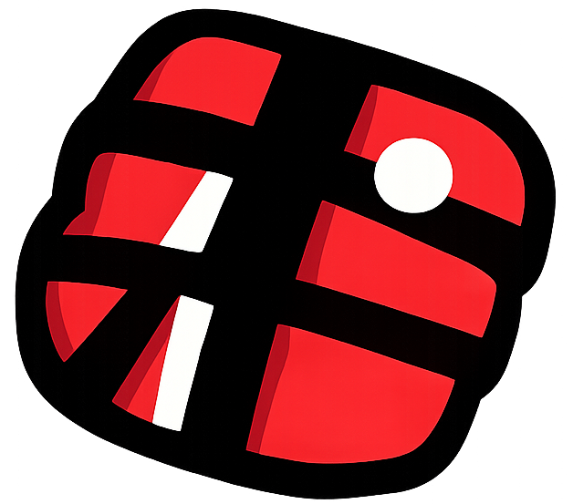</a>
  <a href="#outlaw-killing">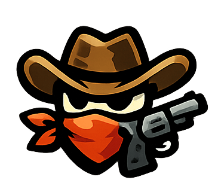</a>
  <a href="#witch-killing">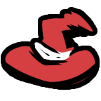</a>
  
  <a href="#poisoner-power">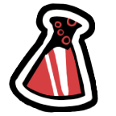</a>
  <a href="#rc-xd-power">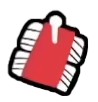</a>
  <a href="#wraith-power">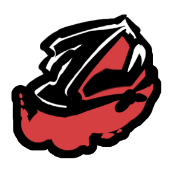</a>
  
  <a href="#charlatan-support">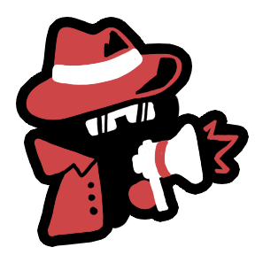</a>
  <a href="#hacker-support">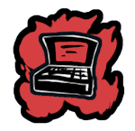</a>
  <a href="#injector-support">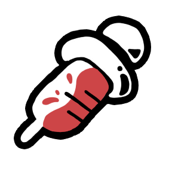</a>
  
  
  
  
  
  <a href="#joker-evil">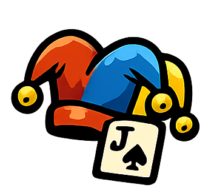</a>
  <a href="#pirate-evil">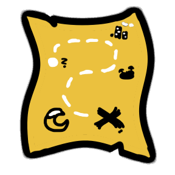</a>
  <a href="#pope-evil">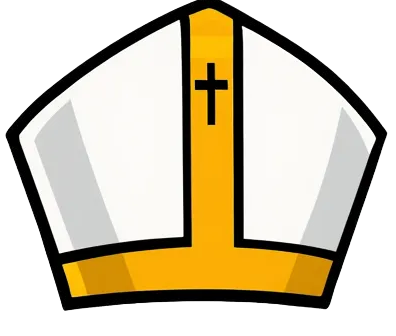</a>
  <a href="#vulture-evil">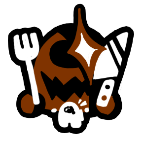</a>
  
  <a href="#doppelganger-killing">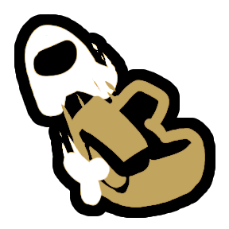</a>
  <a href="#pelican-killing">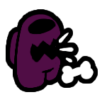</a>
  <a href="#serial-killer-killing">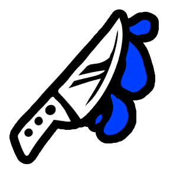</a>
  <a href="#shroud-killing">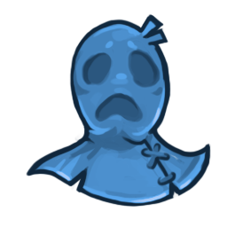</a>
  
  <a href="#publicity-crewmate">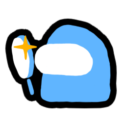</a>
  <a href="#ventable-crewmate">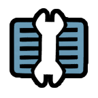</a>
  
  <a href="#lucky-impostor">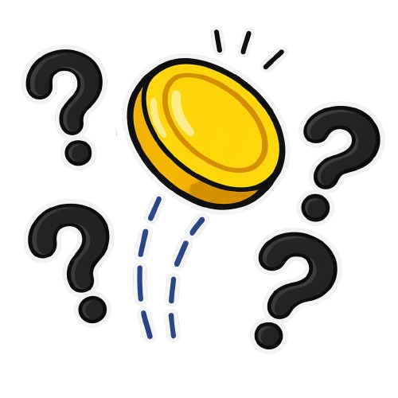</a>
  
  <a href="#child-universal">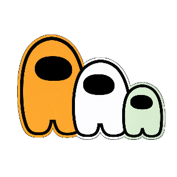</a>
  <a href="#clueless-universal">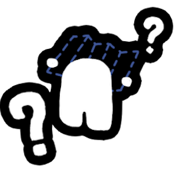</a>
  
  <a href="#spiteful-universal">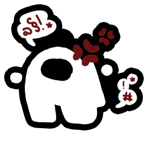</a>
  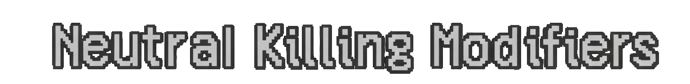  
  <a href="#death-note-neutral-killing">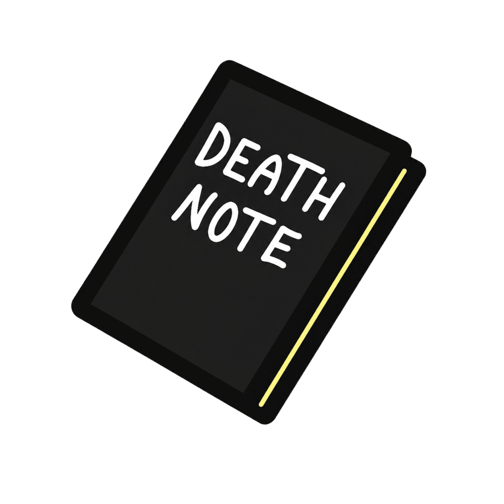</a>
  <a href="#venomous-neutral-killing">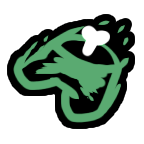</a>

-----------------------

# Roles & Modifiers

## Crewmate Roles

### Falcon (Crewmate Investigative)
Zoom out the camera to see a wider area for a limited duration. Cannot be used during lights sabotage.

### Sage (Crewmate Investigative)
Compare Players Instead of Checking Alignments. Compare the alignments of other players, learning if players are friendly or enemies.

### Vanisher (Crewmate Investigative)
Vanisher can temporarily turn invisible to avoid being seen. May Neutral and Impostor roles get alert when u are close to them.

### Vampire Hunter (Crewmate Killing)
Vampire Hunter only appears when there are vampires in the game. Vampire Hunter stakes other players; if the player is not a vampire, the stake is wasted and nothing happens. If the targeted player is a vampire, they die. If there are no vampires left in the game, Vampire Hunter receives a new role based on the game settings.

### President (Crewmate Power)
Abstain from voting to bank votes, then spend them all at once in a future meeting.

### Bodyguard (Crewmate Protective)
Shield a player. When they're attacked, teleport to them and eliminate the attacker but you die too.

### Evoker (Crewmate Support)
Activate Blind to Flash all killing roles are blinded they cannot use any abilities and can only see themselves. Depending on the host settings, the Evoker may verify whether players are killing roles or not.

### Forestaller (Crewmate Support)
Complete all tasks to disable sabotages while alive. Revealed in meetings after completing all tasks.

### Mirage (Crewmate Support)
Place a decoy with the appearance of yourself or a random player. If anyone interacts with it, it vanishes and both sides are notified.

### Trapper (Crewmate Support)
Place traps on vents that immobilize players who use them. Get notifications when traps are triggered.

## Impostor Roles

### Kamikaze (Impostor Killing)
Detonate yourself to kill all nearby players. You die in the process.

### Outlaw (Impostor Killing)
After killing, you have a short window to kill additional players without cooldown.

### Witch (Impostor Killing)
Cast spells on players. Spellbound players are highlighted in meetings and die after a configured number of meetings. If the Witch dies, all spellbound players survive.

### Poisoner (Impostor Power)
Poison players on contact (delayed death) or use Vine to remotely kill the nearest player in range.

### RC-XD (Impostor Power)
Deploy a remote-controlled explosive car. Drive it with arrow keys and detonate it near enemies.

### Wraith (Impostor Power)
Dash for a speed boost. Place a Lantern to teleport back to it and briefly turn invisible. If the Lantern expires, it leaves permanent evidence.

### Charlatan (Impostor Support)
Deceive to report your own kills from any distance. Conceal to reduce the report range of nearby bodies.

### Hacker (Impostor Support)
Download info from Admin/Cams/Vitals to charge a portable device. Jam disrupts info systems like comms sabotage. Gain jam charges from kills.

### Injector (Impostor Support)
Inject players with a random effect (negative or positive) after a delay. Starts with limited uses, gains more from kills.

## Neutral Roles

### Lawyer (Neutral Benign)
Win by keeping your assigned client from being voted out. Object to votes during meetings.

### Shifter (Neutral Benign)
Steal another player's role at the next meeting. You can only steal a Crewmate role if you attempt to steal a non-Crewmate role, you die in the process.

### Bounty Hunter (Neutral Evil)
Hunt assigned targets. The Bounty Hunter can only kill their assigned targets. Eliminate all targets to win.

### Joker (Neutral Evil)
Place clones of other players on the map. When killing roles attack clones, it counts toward your win.

### Pirate (Neutral Evil)
Challenge players to Rock-Paper-Scissors duels during meetings. Win enough duels to win the game.

### Pope (Neutal Evil)
Canonize all living players, then trigger Divine Judgement a countdown that kills everyone if it reaches zero.

### Vulture (Neutral Evil)
Eat dead bodies to win. Optionally use Scavenge for arrows to corpses. If win condition becomes impossible, become a configured role.

### Doppelganger (Neutral Killing)
Kill players to steal their appearance until the next meeting.

### Pelican (Neutral Killing)
Swallow players to trap them in your stomach. They're digested when a meeting is called. If you die, they escape.

### Serial Killer (Neutral Killing)
Kill everyone to win alone. Can optionally kill players in vents, but loses venting ability after.

### Shroud (Neutral Killing)
Mark a player with a deadly trap. Anyone who interacts with them dies. If no one does, the marked player dies at the meeting.

## Modifiers

### Child (Universal Passive)
While underage, you cannot be killed. You age over time. Once adult, you lose protection.

### Clueless (Universal Passive)
Removes all task guidance (task list, arrows, map locations). Tasks still work normally.

### Death Note (Neutral Utility)
Find a notebook near a vent. Write a player's name to curse them with a delayed heart attack death.

### Drunk (Universal Passive)
Movement controls are inverted for a set number of meetings.

### Spiteful (Universal Passive)
When voted out, everyone who voted for you receives a negative effect (lower vision, slowness, or increased cooldowns).

### Lucky (Impostor Passive)
After each kill, your kill cooldown is randomized between a configured min and max.

### Venomous (Neutral Killing)
After a set amount of time, the body of a killed player will rot away, preventing it from being reported.

### Publicity (Crewmate Passive)
See the real colors of player's votes during meetings.

### Ventable (Crewmate Utility)
Grants limited vent access with a cooldown and max duration.

## Additional Features & Tweaks

### Egotist Tweaks
Added options to allow the Egotist modifier to use vents, have Impostor vision, and custom vent cooldowns.

### Polish Language Support
An option added to use Polish localizations via `ExtensionLocalSettingUsePolish`.

### Classic Assassin Guessing
Optional cycling-style assassin guessing (arrows + guess button instead of panel menu). The advantage of this setting is that once you select a role to guess and the meeting ends, that person's role is saved on the next meeting.

### Legacy Guess Death Animation
Optional old-style death animation for guessing.

### Joker PiP Customization
Added local settings to adjust the Picture-in-Picture size and location for the Joker role.

-----------------------

# Chat Commands

- `/me` - Displays information about your role, modifiers and task progression.

-----------------------

# Draft Mode

Draft Mode is a special game feature that lets players take turns choosing their roles before the game starts, similar to draft picks in sports or competitive games.

## How It Works

1. **Pre-Game Setup** - Host enables Draft Mode in the lobby options
2. **Draft Phase** - When the game starts, instead of random role assignment, a draft UI appears
3. **Turn-Based Picking** - Players take turns selecting their desired role from a pool of available roles
4. **Timer** - Each player has limited time to pick (configurable by host)
5. **Random Fallback** - If a player doesn't pick in time, a random role is assigned
6. **Game Start** - Once all players have picked, the game begins with chosen roles

## Features

- **Visual Draft UI** - Clean interface showing available roles, current picker, and time remaining
- **Role Categories** - Roles organized by alignment (Crewmate, Impostor, Neutral)
- **Pick Order Display** - See how many turns until your pick
- **Audio Cues** - Alert on draft complete, your turn, and pick confirmation
- **Random Button** - Can't decide? Pick a random role from your side

## Configuration Options

| Option | Description |
|--------|-------------|
| Enable Draft Mode | Toggle draft mode on/off |
| Lock Lobby During Draft | Prevent players from joining mid-draft |
| Time To Choose | Seconds each player has to pick |
| Roles To Show | Number of role options displayed |
| Impostor Pick from all classes | Player can draft from all valid factions for their side |
| Crewmate Pick from all classes | Player can draft from all valid factions for their side |
| Respect Role Chances | Draft pool follows lobby spawn probabilities |

## Showcase

### Visual Gallery

  <table border="0">
    <tr>
      <td>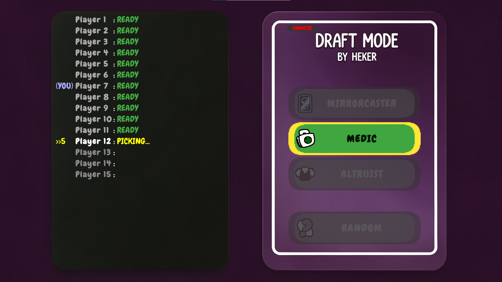</td>
      <td>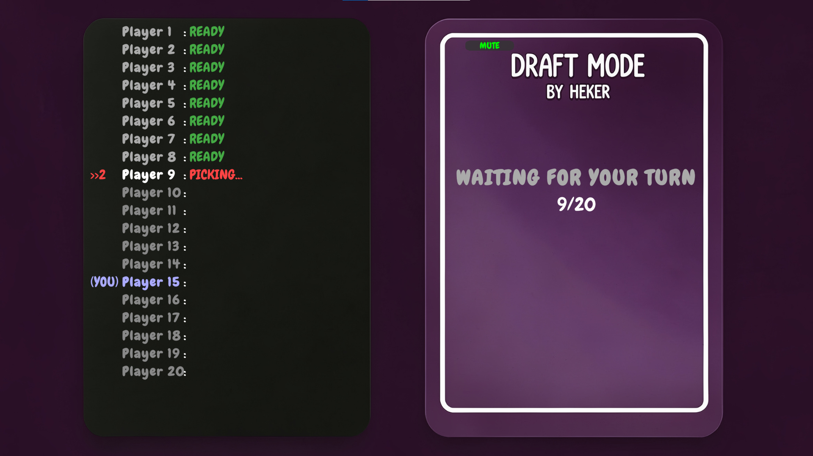</td>
      <td>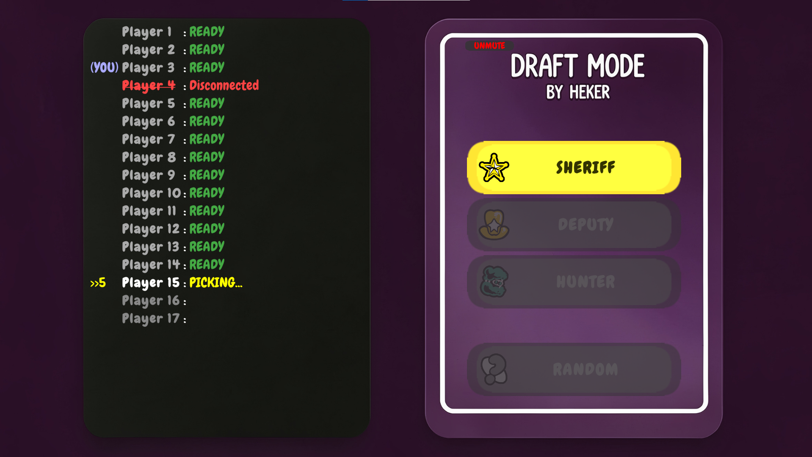</td>
    </tr>
  </table>

### Gameplay Video (PiP)
> [!TIP]
> Click the thumbnail below to watch the Draft Mode in action!

  

-----------------------

# Installation

1. Ensure you have [Town of Us: Mira](https://github.com/AU-Avengers/TOU-Mira) installed.
2. Build this project or download a release.
3. Place the compiled DLL in your `BepInEx/plugins/` folder.

-----------------------

# Building

1. Clone this repository.
2. Restore NuGet packages.
3. Build the solution in Visual Studio or using `dotnet build`.

-----------------------

# Requirements

- .NET 6.0
- Town of Us: Mira 1.6.0 or later
- MiraAPI 0.4.0 or later
- Reactor 2.5.0 or later

-----------------------

# Credits

## Original Extension
- **[rewalo](https://github.com/rewalo)** - Original [TownOfUsMiraRolesExtension](https://github.com/rewalo/TownOfUsMiraRolesExtension) that this project is forked from

## Art Credits

> **Huge shoutout to Atony**, creator of Town of Us: Mira — roughly 70% of the art assets used in this mod originate from his work, various TOU Mira builds, and resources shared on the TOU Mira Discord. We are extremely grateful for his incredible contributions to the community.

- **Asterisken** - Art for Injector, Trapper, Clueless, Mirage, Charlatan, Vulture, Forestaller, Spiteful and Objection Button
- **Atony / Town of Us: Mira / Town Of Us Discord** - Art for Serial Killer, Lawyer, Witch, Wraith; Shifter role icon & button; Bodyguard role icon; Vampire Hunter role icon; Vanisher icon (recolored Swooper); Sage role icon (Seer button from TOU Mira); Sage ability buttons (Salem option buttons from Seer); Bodyguard shield animation (repainted Warden shield from TOU Mira 1.5.9); Poisoner role icon & all Poisoner button icons; Evoker Verify button icon; Shroud ability button icon; Drunk modifier icon (from TOU Mira Discord); Venomous modifier icon (flipped & recolored Rotting modifier from TOU Mira)
- **Atony / TOU Mira Fusion** - Vampire Hunter stake button
- **Stellar Roles** - Role ideas, some button art
- **[Launchpad Reloaded](https://github.com/All-Of-Us-Mods/LaunchpadReloaded)** - Doppelganger role icon
- **[All Of Us](https://github.com/All-Of-Us-Mods)** - Death Note modifier icons (from their Discord)
- **Sidemen (YouTube)** - Kamikaze role icon (temporary, detonator icon); RC-XD Deploy & Detonate button icons
- **TOHE** - Shroud role icon
- **Star Wars** - Bounty Hunter role icon
- **Our friend's girlfriend** - Publicity modifier icon

## Sound Credits
- **Radzik360** - Joker laugh (intro & in-game), Kamikaze explosion sound, Pelican swallow sound
- **Ano** - Pope intro sound
- **Innersloth & Puffballs United** - Draft music ("Seek")
- **Dymowy Among Us (Tajemniczy Typiarz)** - Draft pick sound, Draft alert sound
- **Death Note (anime)** - Death Note kill sound (Light's laugh)
- **YouTube** - Pope alarm & Judgement end sounds (from Divine Judgement concept videos)
- **Star Wars** - Bounty Hunter intro sound
- **Max Verstappen memes** - RC-XD intro sound (song fragment)
- RC-XD driving sound from a royalty-free sound website

## Role Inspirations & Concepts
- **[TOHE (Town of Host Enhanced)](https://github.com/0xDrMoe/TownofHost-Enhanced)** - Doppelganger role concept; Shroud role concept
- **[Syzyfowe TOU ](https://github.com/LimeShep/Town-Of-Us/)** - Evoker role concept; Pelican role concept
- **Tajemniczy Among Us (Tajemniczy Typiarz)** - Pirate role concept
- **[Town of Us WYGON ](https://github.com/wygon/Town-Of-Us-WYGON)** - Falcon role concept; Kamikaze role concept
- **Sidemen (YouTube)** - RC-XD & Poisoner roles concept (recreated from their videos)
- **Death Note (anime)** - Death Note modifier concept
- **Our friend Weakpass** - Added Publicity modifier

## Wiki & Documentation
- **dziabe** - Helped with shortening role descriptions for the wiki (minimal effort)

## Frameworks & Dependencies
- **[Town of Us: Mira](https://github.com/AU-Avengers/TOU-Mira)** - Base mod
- **[MiraAPI](https://github.com/All-Of-Us-Mods/MiraAPI)** - Modding framework
- **[Reactor](https://github.com/NuclearPowered/Reactor)** - Mod dependency
- **[BepInEx](https://github.com/BepInEx)** - Game function hooking

## Honorable Mention 🙃
- **Pozwo** for encouraging us to bring this project to Github!
- **Arbuzia** for saying that im too young to program mods without putting in them viruses!
- no offence lol
- **Majusia** died during development of mod, born in 15.01.26 died in 23.01.2026 Rest in Pieces (absolutely serious)

-----------------------

# License
This software is distributed under the GNU GPLv3.0 License.

# Copyright

This mod is not affiliated with Among Us or Innersloth LLC, and the content contained therein is not endorsed or otherwise sponsored by Innersloth LLC. Portions of the materials contained herein are property of Innersloth LLC.

© Innersloth LLC.

